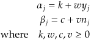

### Syllabus

| Week | Topic | Exercise | Links |
|:----:|:-----:|:--------:|:-----:|
| 1    | Introduction to Bayesian Inference | Read Bayesian Data Analysis (BDA) Chapters 1 & 2, Intro to Bayesian updating paper, and Pyro paper.     Form up groups and ask a question for each chapter/paper you have read. | [Bayesian Data Analysis](http://www.stat.columbia.edu/~gelman/book/)     [Bayesian Updating Paper](https://arxiv.org/pdf/1411.5018.pdf)    [Pyro Paper](http://jmlr.org/papers/volume20/18-403/18-403.pdf) |
| 2  | Variational Inference | Read the Variational Inference paper, and ask three questions about it.     Use Pyro’s Variational Inference support to implement the BDA kidney cancer model (Fig. 2.8), and the BDA hierarchical 2008 election poll model (Exc. 2.21)     **Hint:** Instead of having individual parameters for the Gamma distribution in the guide, it is possible to make the arguments functions based on the observed death count and population like so:      Here k, w, c and v are global parameters. This makes inference orders of magnitude more effective! | [Variational Inference Paper](https://arxiv.org/pdf/1601.00670.pdf)     [Pyro Website](https://pyro.ai) |
| 3 | Variational Auto-Encoders | Read Variational Auto Encoders (VAE) foundations Chapters 1 & 2, and Pyro tutorial on VAE. Ask three questions about the paper and tutorial.     Implement Frey Faces model from VAE paper in Pyro. Rely on the existing VAE implementation (see tutorial link). | [Variational Auto Encoders Foundations](https://arxiv.org/abs/1906.02691)     [Pyro Tutorial on VAE](https://pyro.ai/examples/vae.html) |
| 4 | Hamiltonian Monte Carlo | Read papers on Hamiltonian Monte Carlo and No U-Turn Sampler. Look at the source code for Mini-MC.     Read on how enumerated inference can be used to marginalize latent variables using Pyro mixture model tutorial.     Ask a question each for HMC, the Mini-MC implementation and discrete variable marginalization.     Implement Bayesian Change-point model in Pyro using NUTS. | [Hamiltonian Monte Carlo Paper](https://arxiv.org/pdf/1701.02434.pdf)     [No U-Turn Sampler](http://jmlr.csail.mit.edu/papers/volume15/hoffman14a/hoffman14a.pdf)     [Mini-MC implementation](https://github.com/ColCarroll/minimc)    [Pyro Discrete Variables Tutorial](https://pyro.ai/examples/enumeration.html)      [Pyro Gaussian Mixture Model Tutorial](https://pyro.ai/examples/gmm.html) (shows NUTS + discrete variables)       [Change-point model](https://cscherrer.github.io/post/bayesian-changepoint/) |
| 5 |  Bayesian Regression Models | Read BDA Chapters 14 & 15 on Bayesian regression models.     Ask 3 questions about the chapters.     Implement the US presidential election forecast model in NumPyro from BDA Chapter 15. Compare results from full variational inference and NUTS.     **Hint:** The forecast model is specified around equation 15.2 | Pyro Bayesian Regression: [Part I](https://pyro.ai/examples/bayesian_regression.html), [Part II](https://pyro.ai/examples/bayesian_regression_ii.html) |
| 6 | Mini-Project | Choose a reasonably interesting Bayesian model to implement in Pyro. Write a report on the model and implementation. Examples include a model from FiveThirtyEight,  TrueSkill from Microsoft or CAPTCHA breaking using PyProb.     Questions to consider: What is the runtime of the system? What is the uncertainty of parameters? Does the posterior predictive distribution look reasonable? Can you make useful new predictions? | [FiveThirtyEight Methodology and Models](https://fivethirtyeight.com/tag/methodology/)     [Microsoft TrueSkill Model](https://www.microsoft.com/en-us/research/publication/trueskill-2-improved-bayesian-skill-rating-system/) (Can be implemented in [Infer.NET](https://dotnet.github.io/infer/) using [Expectation Propagation](https://arxiv.org/pdf/1412.4869.pdf) instead of Pyro's Variational Inference or MCMC sampling)     CAPTCHA Breaking using [Inference Compilation](https://arxiv.org/pdf/1610.09900.pdf) and [PyProb](https://pyprob.readthedocs.io/en/latest/#). You can use the experimental [PyProb bindings for Java](https://github.com/ahmadsalim/pyprob_java) and [Oxford CAPTCHA Generator](https://github.com/gbaydin/OxCaptcha). |
| 7 | Mini-Project | Cont. | |

### Recommendations
* Sometimes sampling can be slow on the CPU for complex models, so try using Google Colab and GPUs and see if that provides an improvement.
* Consider early what mini-project you want to do and start reading up, gathering data and generate ideas on the relevant subject.

### Acknowledgements
This course has been developed by [Thomas Hamelryck](https://github.com/thamelry) and [Ahmad Salim Al-Sibahi](https://github.com/ahmadsalim). Thanks to [Ola Rønning](https://github.com/olaronning) for suggesting the [Variational Auto Encoders Foundations](https://arxiv.org/abs/1906.02691) paper instead of [Auto-Encoding Variational Bayes](https://arxiv.org/pdf/1312.6114.pdf) which we originally proposed to read on week 3.
